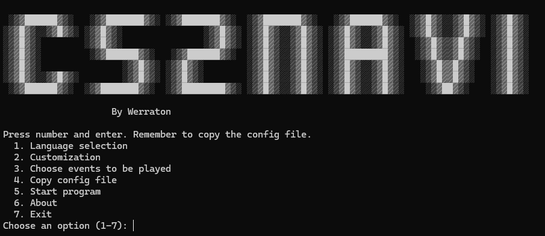

### CS2Navi

CS2Navi is a Counter-Strike 2 add-on that provides audio feedback for various in-game states, such as bomb possession, defuse kit collection, and player health. The goal is to give players real-time audio cues to enhance gameplay awareness.

### Features

- Notifies when you pick up the bomb or defuse kit.
- Alerts you when your health is low or you have low ammo.
- Provides feedback about the bomb's state and whether you have a defuse kit when it's planted.

- Bilingual Support: The program defaults to English, but you can switch the language to Finnish.
- Audio Alerts: You will receive audio alerts based on different in-game events.
- Customizable Settings: You can adjust the program's settings to your liking.

### Installation

### Python Version

1. Clone this repository:

git clone https://github.com/Werraton/cs2navi.git

2. Install the required dependencies:

pip install -r requirements.txt

3. Run the program:

python cs2navi.py

### Executable Version
For users who prefer not to run the code from Python, you can download the `.exe` file from the `releases` page. Place it in your desired folder, ensure you have the necessary configuration in place (detailed below), and run it directly.
It can take sometime (minute or two)

### Usage

1. Select 4. from menu and use default folder or paste custom folder.
Place the provided configuration file in your game's `cfg` folder:
C:\Program Files (x86)\Steam\steamapps\common\Counter-Strike Global Offensive\csgo\cfg or another folder where game is installed. 

2. Launch the program and follow the in-menu instructions to select your settings.

3. Audio cues will start automatically as you play.

Ctrl+c combination returns to the main menu

### Configuration Files

The program includes configuration files that can be customized based on your preferences. Place the `gamestate_integration_cs2navi.cfg` file in your CS:GO `cfg` folder. The program settings (like volume, language, and event triggers) can be modified in the `settings.json` file.

## Author

This program was created and is maintained by Werraton. You can find the official repository at:

[https://github.com/Werraton/cs2navi](https://github.com/Werraton/cs2navi)

---

### CS2Navi

CS2Navi on Counter-Strike 2 -lisäohjelma, joka tarjoaa äänipalautetta erilaisista pelin tiloista, kuten pommin hallussapidosta, defusointikitin keräämisestä ja pelaajan terveydestä. Tavoitteena on antaa pelaajille reaaliaikaisia äänivihjeitä parantaakseen pelikokemusta.

### Ominaisuudet

- Ilmoittaa, kun otat pommin tai defusointikitin.
- Varoittaa, kun terveytesi on alhainen tai sinulla on vähän ammuksia.
- Antaa palautetta pommin tilasta ja siitä, onko sinulla defusointikitti, kun pommi asetetaan.
- Kaksikielinen tuki: Oletuskieli on englanti, mutta voit vaihtaa kielen suomeksi.
- Ääni-ilmoitukset: Saat ääni-ilmoituksia pelin eri tapahtumien perusteella.
- Mukautettavat asetukset: Voit säätää ohjelman asetuksia haluamallasi tavalla.
- Debug-tila: Voit ottaa debug-tilan käyttöön tai poistaa sen käytöstä päävalikosta.

### Asennus

### Python-versio

1. Kloonaa tämä repositorio:

git clone https://github.com/Werraton/cs2navi.git

2. Asenna tarvittavat riippuvuudet:

pip install -r requirements.txt

3. Suorita ohjelma:

python cs2navi.py

### Suoritettava versio
Jos et halua ajaa ohjelmaa Pythonista, voit ladata .exe-tiedoston releases-sivulta. Sijoita se haluamaasi kansioon, varmista, että tarvittavat asetukset ovat paikoillaan (katso alla), ja suorita ohjelma suoraan. Käynnistyminen voi kestää hetken (minuutin tai kaksi).

Käyttöohjeet:

1. Käynnistä ohjelma ja noudata valikossa annettuja ohjeita asetusten valitsemiseksi. Ohjelma käynnistymiseen saattaa mennä minuutti tai kaksi.

2. Valitse valikosta kohta 4. ja käytä oletuskansiota tai syötä oma kansio.

Sijoita toimitettu asetustiedosto pelin cfg-kansioon:
C:\Program Files (x86)\Steam\steamapps\common\Counter-Strike Global Offensive\csgo\cfg
tai toiseen kansioon, johon peli on asennettu.

3. Äänivihjeet käynnistyvät automaattisesti, kun pelaat.

### Asetustiedostot

Ohjelma sisältää asetustiedostoja, joita voi muokata omien mieltymystesi mukaan. Sijoita gamestate_integration_cs2navi.cfg-tiedosto CS:GO
cfg-kansioon. Ohjelman asetuksia, kuten äänenvoimakkuutta, kieltä ja tapahtumien ilmoituksia, voi muokata settings.json-tiedostossa.

Ctrl+c yhdistelmä palauttaa päävalikkoon

## Tekijä

Ohjelman on luonut ja sitä ylläpitää Werraton. Löydät virallisen repositorion täältä:

[https://github.com/Werraton/cs2navi](https://github.com/Werraton/cs2navi)
