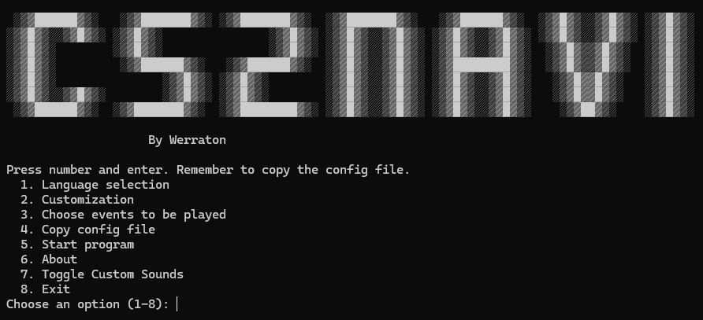

# <span style="color:#ff4500">CS2Navi</span>

*CS2Navi* is a *Counter-Strike 2* add-on providing **audio feedback** for various in-game states, such as bomb possession, defuse kit collection, and player health. Designed to enhance gameplay awareness with real-time audio cues.



---

## <span style="color:#00ff00">Features</span>

- **Alerts** when you pick up the bomb or defuse kit.
- **Alerts** when shooting too fast with XM or Deagle.
- **Warnings** for low health or low ammo.
- Provides **feedback** on bomb status and defuse kit possession when the bomb is planted.
- **Bilingual Support**: Defaults to English, switchable to Finnish.
- **Audio Customization**: *New in this version!* Easily enable **custom sounds** from the main menu.
- **Fully Customizable**: Adjust settings to match your play style.
- **Debug Mode**: Enable or disable debug mode from the main menu.

---

## <span style="color:#ff4500">Installation</span>

### <span style="color:#00ff00">Python Version</span>

1. Clone this repository:
   ```bash
   git clone https://github.com/Werraton/cs2navi.git

2. Install the dependencies:
   ```bash
   pip install -r requirements.txt

3. Run the program:

   ```bash
   python cs2navi.py

Executable Version:
For those who prefer not to run the code from Python, a .exe file is available on the releases page. Place it in your desired folder, ensure the necessary configuration is in place (see below), and run it directly.

<span style="color:#ff4500">Usage</span>
Start the program and select option 4 from the menu. Choose the default folder or specify a custom folder.
Place gamestate_integration_cs2navi.cfg in your game’s cfg folder.
Example path: C:\Program Files (x86)\Steam\steamapps\common\Counter-Strike Global Offensive\csgo\cfg
Audio cues will start automatically while you play.
<span style="color:#00ff00">Configuration Files</span>
The program includes configuration files customizable to your preferences. Place the gamestate_integration_cs2navi.cfg file in the game’s cfg folder. Modify settings like volume, language, and event triggers in the settings.json file.

Press Ctrl+C to return to the main menu.

<span style="color:#ff4500">Author</span>
Created and maintained by Werraton. Find the official repository here:

https://github.com/Werraton/cs2navi

---
---


# <span style="color:#ff4500">CS2Navi</span>

*CS2Navi* on *Counter-Strike 2* -lisäohjelma, joka tarjoaa **äänipalautetta** erilaisista pelin tiloista, kuten pommin hallussapidosta, defusointikitin keräämisestä ja pelaajan terveydestä. Tavoitteena on antaa pelaajille reaaliaikaisia äänivihjeitä parantaakseen pelikokemusta.


---

## <span style="color:#00ff00">Ominaisuudet</span>

- **Ilmoitukset** pommin tai defusointikitin noutamisesta.
- **Ilmoitukset** antaa äänimerkin, kun ammutaan liian nopeast XM tai Deagle aseilla.
- **Varoitukset** alhaisesta terveydestä tai vähistä ammuksista.
- Tarjoaa **palautetta** pommin tilasta ja siitä, onko sinulla defusointikitti, kun pommi on asetettu.
- **Kaksikielinen tuki**: Oletuskieli on englanti, mutta voit vaihtaa kielen suomeksi.
- **Äänien muokkaus**: *Uutta tässä versiossa!* Ota käyttöön **custom-äänet** helposti ohjelman valikosta.
- **Täysin mukautettavissa**: Voit säätää asetuksia omien mieltymystesi mukaan.
- **Debug-tila**: Voit ottaa debug-tilan käyttöön tai poistaa sen käytöstä päävalikosta.

---

## <span style="color:#ff4500">Asennus</span>

### <span style="color:#00ff00">Python-versio</span>

1. Kloonaa tämä repositorio:
   ```bash
   git clone https://github.com/Werraton/cs2navi.git

2. Asenna riippuvuudet:

   ```bash
   pip install -r requirements.txt

3. Suorita ohjelma:

   ```bash
   python cs2navi.py

Suoritettava versio:
Jos et halua ajaa ohjelmaa Pythonista, voit ladata .exe-tiedoston releases-sivulta. Sijoita se haluamaasi kansioon, varmista, että tarvittavat asetukset ovat paikoillaan (katso alla), ja suorita ohjelma suoraan.

<span style="color:#ff4500">Käyttö</span>
Käynnistä ohjelma ja valitse asetuksista 4. kohta. Käytä oletuskansiota tai syötä oma kansio.
Aseta gamestate_integration_cs2navi.cfg pelin cfg-kansioon:
Esimerkki: C:\Program Files (x86)\Steam\steamapps\common\Counter-Strike Global Offensive\csgo\cfg
Äänivihjeet käynnistyvät automaattisesti pelin aikana.
<span style="color:#00ff00">Asetustiedostot</span>
Ohjelma sisältää asetustiedostoja, joita voi muokata omien mieltymystesi mukaan. Sijoita gamestate_integration_cs2navi.cfg pelin cfg-kansioon. Ohjelman asetuksia (kuten äänenvoimakkuutta, kieltä ja tapahtumien ilmoituksia) voi muokata settings.json-tiedostossa.

Ctrl+C palaa päävalikkoon.

<span style="color:#ff4500">Tekijä</span>
Ohjelman on luonut ja sitä ylläpitää Werraton. Löydät virallisen repositorion täältä:

https://github.com/Werraton/cs2navi
